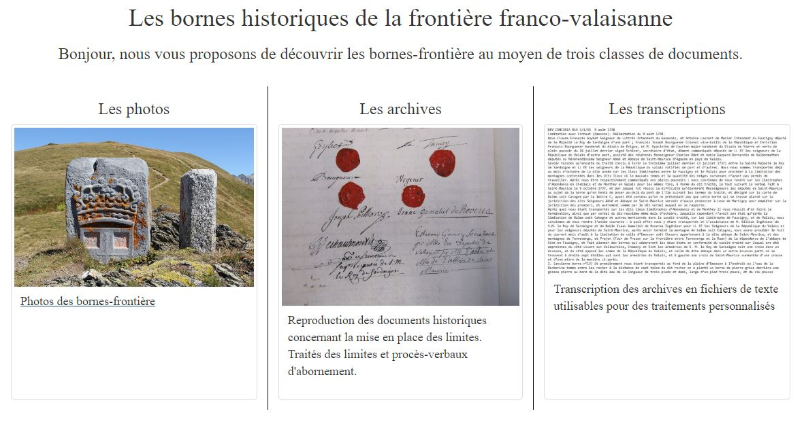
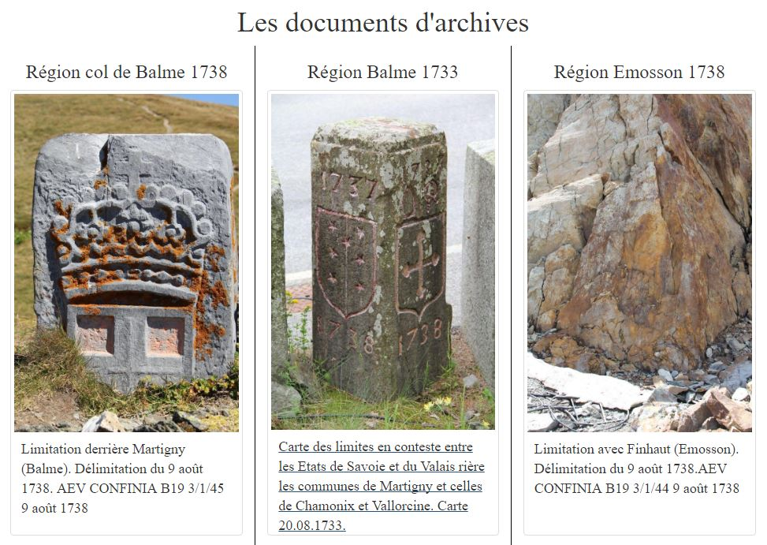
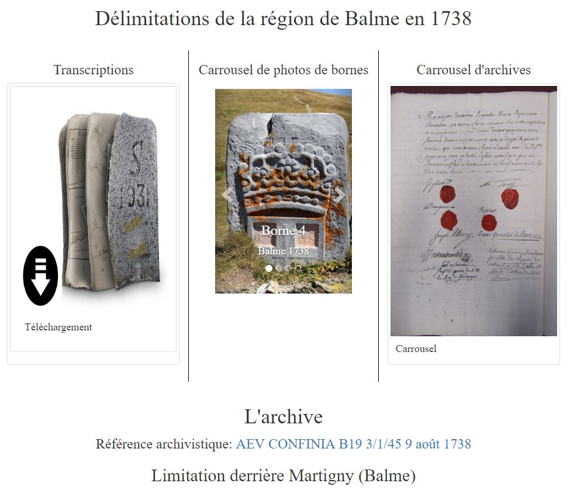
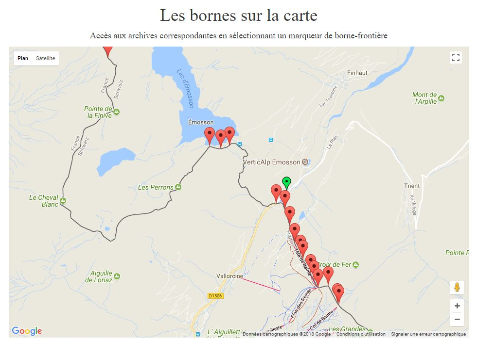

# bornesfrontieres
__________________________________________________________________________________________________________
Archives du XVIIIe siècle sur la mise en place de la frontière franco-valaisanne (alors sabaudo-valaisanne)
__________________________________________________________________________________________________________
Ce site web vous propose un voyage dans les archives de la mise en place des frontières du
canton du Valais. Ces archives se composent des traités et des procès-verbaux d’abornement
ainsi que des bornes-frontière historiques encore en place sur la limite internationale. 

Le site est accessible sur gitub :
https://ibornes.github.io/bornesfrontieres/

Ou sur le web à l'adresse suivante :
http://www.bornesfrontieres.ch/#!/

Principales fonctions :
1. Accueil et information: organisation du site autour de six archives et de leurs transcriptions

2. Accès aux six archives par click sur le document désiré (par exemple Région col de Balme 1738)

3. Accès aux archives soit : 
    (A) Archive transcrite à télécharger ou (en dessous) archive transcrite avec hover et liens
    (B) Carrousel de photos des bornes historiques concernées
    et (C) Carrousel des documents d'archive en haute définition

4. Accès aux archives à travers un click sur l'emplacement des bornes-frontière sur une carte topographique

__________________________________________________________________________________________________________
